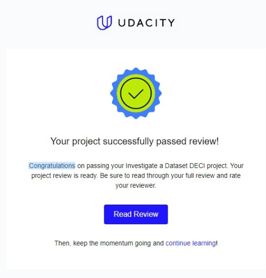

# Investigate A Dataset
This is a project related to <b>DECI Y2 L3 Data Analysis & AI"</b>

I was asked to choose from two datasets on Kaggle:
* [European Soccer Database](https://www.kaggle.com/datasets/hugomathien/soccer)
* [TMDB 5000 Movie Dataset](https://www.kaggle.com/datasets/tmdb/tmdb-movie-metadata)

I chose the movie dataset because I found a huge potential in this dataset.

And then, I was asked to investigate that dataset and perform the whole data analysis process under the guidance of my instructors.
That was a great opportunity to apply the concepts I've learnt in the past 3 months.

I submitted the project on 30/4/2024. And I got a perfect score on the first try.

